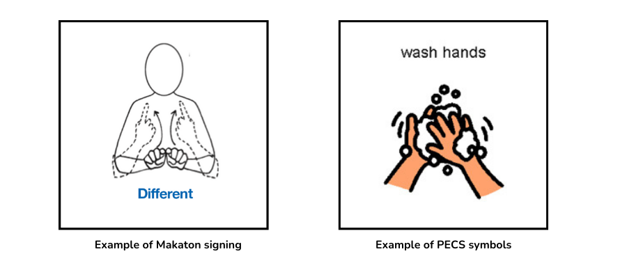

# Capstone Project - Speech recognition in children with learning disabilities using deep learning

## Business Case and Project Purpose

### The importance of communication for people with severe learning disabilities

Communication is vital in ensuring that people can express themselves, control their environment and make sense of the world around them.

This is equally if not more important when that person has a learning disability and may not be able to interpret their environment as easily as others.

Communicating with children and young people who have a severe learning disability can be extremely challenging, if a child is not able to communicate by traditional methods they may become frustrated and use behaviours that might be seen as challenging.

For example, in self-harm behaviour, the child may be wanting to communicate that they are in pain or discomfort or that they are hungry, thirsty etc. If the behaviour is effective in getting what the child needs it is more likely to be repeated.


### Types of communication
There are various forms and stages of communication but, broadly speaking, communication can be split into two types:

**Expressive Language –**

Expressive language is the use of words to form sentences in order to communicate with other people.

Difficulties in using expressive language to communicate can range from experiencing difficulties putting words in the right order to being unable to form words in a meaningful way that others can understand.

When someone is unable to make use of expressive language, it can lead to frustration at not being able to express their needs and difficulty interacting with other people.

**Receptive Language –**

Receptive language is the understanding of expressive language. The use of receptive language is not dependent on being able to use expressive language. Some people may not be able to form words and sentences themselves, but are able to understand expressive language when it is used by others.

This can range from being able to easily understand what others say, to being able to only understand key words and phrases, and then only when they are spoken clearly and slowly. Everyone is different; some people may be able to use both receptive and expressive language to different degrees, whilst others may be able to use one or neither.

### Communication techniques for people with learning disabilities
Some people with learning disabilities have difficulties communicating with others when solely making use of expressive and receptive language.

There are a variety of other techniques which have been developed to help support people for whom speech is difficult, for example:

* Communication systems such as Makaton (based on British sign language) or PECS (Picture Exchange communication system)
* Easy read symbols
* Speech and language therapy



People with learning disabilities often interpret body language and non-verbal communication in understanding simple everyday interactions.

It is essential when communicating with someone with a learning disability to give them time to take in what is being said, and to communicate more slowly than you may normally in order to allow them to process what it is that you are communicating.

It is often hard to know what support is available to help people with learning disabilities communicate more easily.

Using visual guides or cues to aide communication is one important way of supporting people to have a greater understanding of what is being conveyed to them.

### Brief

**Supporting communication in children with non-typical speech using Deep Learning**

The purpose of this project is to use Data Science and deep learning techniques to build a model that can suitably classify audio samples from an individual with a speech disorder or with a severe learning disability that impacts speech.

The eventual aim being a tool or app that helps parents of children like Martha with a speech disorder or severe learning disability support their child's communication.

With adequately supported communication, their child will be better able to:

* Express their needs, feelings or opinions
* Make choices
* Interact with others and form relationships.
* Develop skills which will help them access learning opportunities.

Parents would be able to use the app, installed on a mobile device, to record their child speaking, receiving suggestions as to the word that the child is trying to voice, similar to the Google Recorder app but specifically configured to pick up and trained on atypical speech.

Beyond this, the app would also present an opportunity for parents to add to the dataset by submitting anonymised, labelled audio samples of their child speaking.

## The Datasets

We will be using two datasets for the purpose of this project.

**Speech Commands: A dataset for limited-vocabulary speech recognition –** (Pete Warden, TensorFlow team at Google)

https://arxiv.org/abs/1804.03209

The Speech Commands dataset is an attempt to build a standard training and evaluation dataset for a class of simple speech recognition tasks. Its primary goal is to provide a way to build and test small models that detect when a single word is spoken, from a set of ten or fewer target words, with as few false background noise or unrelated speech.

**Ultrasuite: A collection of ultrasound and acoustic speech data from child speech therapy sessions –** (University of Edinburgh, School of Infomatics)

https://ultrasuite.github.io/

Ultrasuite is a collection of ultrasound and acoustic speech data from child speech therapy sessions. The current release includes three datasets, one from typically developing children and two from speech disordered children:

* [Ultrax Typically Developing (UXTD)](https://ultrasuite.github.io/data/uxtd/) - A dataset of 58 typically developing children.
* [Ultrax Speech Sound Disorders (UXSSD)](https://ultrasuite.github.io/data/uxssd/) - A dataset of 8 children with speech sound disorders.
* [UltraPhonix (UPX)](https://ultrasuite.github.io/data/upx/) - A second dataset of children with speech sound disorders, collected from 20 children.

**IMPORTANT NOTE:**

The source data and audio samples used by the Jupyter notebooks have not been included in this GitHub repository and will need to be downloaded and stored in a folder entitled `data` within the local repository.  

The code with the Jupyter notebook entitled `2_eda.ipynb` will do all the necessary downloading and preprocessing for you but, if you would like to shortcut this or have any issues downloading the data, a zip file containing the processed audio samples for both datasets can be [downloaded here](https://drive.google.com/file/d/11lKYIZiwEQJ-pp0G1bJPHXLJLj8uKPqW/view?usp=sharing)

Once downloaded (and processed if using the Jupyter notebooks), the data should be organised in the following folder structure:
```
└── data

    ├── speech_commands_v0.02                 
        # Raw downloaded format of the Speech Commands dataset containing 105,829 audio samples of 35 spoken keywords
        organised into subfolders for each keyword.

    ├── ultrasuite
        # Raw downloaded format of the Ultrasuite dataset.

        ├── core-upx
        ├── core-uxssd
        ├── core-uxtd
        └── labels-uxtd-uxssd-upx

    ├── ultrasuite_isolated
        # Isolated audio segments of each utterance organised in subfolder relating to the child, session, source file.

        ├── upx
        ├── uxssd
        └── uxtd

    ├── ultrasuite_top35
        # Isolated audio samples, padded to 1 second in duration, of each utterance for the top 35 keywords by number of samples, organised into subfolders for each keyword.

    └── ultrasuite_transformed
        # Isolated audio samples each utterance for the Ultrasuite dataset containing 33,800 audio samples of 991 spoken words organised into subfolders for each keyword.    
```


## Repository Overview
```
1_business_case.ipynb  
# Jupyter notebook containing the business case, project purpose and approach.

2_eda.ipynb
# Jupyter notebook containing code for data download, discovery, audio sample isolation, transformation and EDA.

3_models.ipynb
# Jupyter notebook containing code for a number of deep learning audio classifier models, with improving accuracy, that aim to predict a 
keyword from a given audio sample of a child with a speech disorder or learning disability.

notebook.pdf
# A PDF version of the Jupyter notebooks above.

presentation.pdf
# A non-technical presentation of the project findings.

└── audio
    └── martha-frog.wav
└── images
    ├── communication-is-vital.png
    ├── makaton-pecs-symbols.png
    └── martha-says-hello.jpeg
```


## Presentation

The presentation associated with this project can be found [here](presentation.pdf) within the repository.

## Approach

Classification using big data struggles to cope with the individual uniqueness of disabled people, and while developers tend to design for the majority, so ignoring outliers, designing for edge cases would be a more inclusive approach.

Whilst similar to Project Euphonia by Google AI which is focused on "on helping people with atypical speech be better understood" and providing more equitable access to voice activated technology for users with a speech disability, this project will focus more on understanding and interpreting single words rather than whole sentences for the simple reason that most of the affected children will not be able to speak in full sentences and will have a limited vocabulary. It also also specifically aimed at parents or carers rather than the child themselves.

The initial plan was to use both the Speech Commands dataset combined with the Ultrasuite dataset to train each model but, after some testing and additional research, it was decided to use the Speech Commands dataset to create a "control" model against which the model based on the Ultrasuite data could be compared. This decision was principally so as not to introduce a "typical speech bias" into the final model.

The project constitutes 4 main parts:

1. The **[Business Case and Project Purpose](1_business_case.ipynb)**.

2. Initial **[Exploratory Data Analysis](2_eda.ipynb)** to review, quantify and validate the audio sample data available in each of the datasets.  This section also includes some steps to prepare the data for modelling such as...

3. The creation, refinement through iteration, validation and evaluation of **[Deep Learning Neural Network Models](index.ipynb#deep-learning-neural-networks)** that can classify a 1 second audio sample from a child with a speech disorder.

4. **[Final Model Performance Evaluation](3_models.ipynb#final-model-performance-evaluation)**.

## Conclusions and Recommendations

Initial models did not generalise well and tended to overfit the training data. Subsequent changes to parameters significantly improved the training accuracy but, again were overfitting the training data.

Whilst it does not have a high accuracy score, this final model using a Convolutional Neural Network produced the best results classifying over 70% of the “unseen” audio samples whilst minimising the overfitting to training data.

The very nature of speech sound disorders mean that a model that has been simply trained on audio samples of "typical" speech will generally be more accurate than one that has been trained on audio samples of "atypical" speech as demonstrated above with the model comparison between the Speech Commands and Ultrasuite datasets.

Given the eventual usage of this model, it is arguable the app would be more useful if it suggested three potential words in order of likelihood, giving the parent options of what the child might be trying to communicate.

Recommendations for further work include:

1. Continue to use other model architectures and enable to accept longer audio samples as these are more representative of atypical speech patterns.
2. Source additional data in the form of further audio samples potentially even using the app as a means for gathering additional samples and improving the model.
3. Use data augmentation when training the model, in particular the MixSpeech method that a weighted combination of features such as Mel Spectrograms with MFCCs.


## Requisite Environment and Python Libraries

A Conda virtual environment, `environment.yml` suitable for running this project is available in the `capstone` branch of this [GitHub repository](https://github.com/toopster/dsc-data-science-env-setup-v2-1/tree/capstone)

The following python libraries have been used as part of this project:

* [Pandas](https://pandas.pydata.org/)
* [NumPy](https://numpy.org/)
* [Matplotlib](https://matplotlib.org/)
* [Seaborn](https://seaborn.pydata.org/)
* [os](https://docs.python.org/3/library/os.html)
* [keras](https://keras.io/)
* [scikit-learn](https://scikit-learn.org/)
* [Tensorflow](https://www.tensorflow.org/)
* [PyDub](https://pypi.org/project/pydub/)
* [Wave](https://docs.python.org/3/library/wave.html)
* [Soundfile](https://pypi.org/project/SoundFile/)
* [Librosa](https://librosa.org/doc/latest/index.html)
* [PathLib](https://docs.python.org/3/library/pathlib.html)
* [Shutil](https://docs.python.org/3/library/shutil.html)
* [Collections](https://docs.python.org/3/library/collections.html)
* [Natural Language Toolkit - NLTK](https://www.nltk.org/)
* [JSON](https://docs.python.org/3/library/json.html)
* [IPython](https://ipython.readthedocs.io/en/stable/index.html)